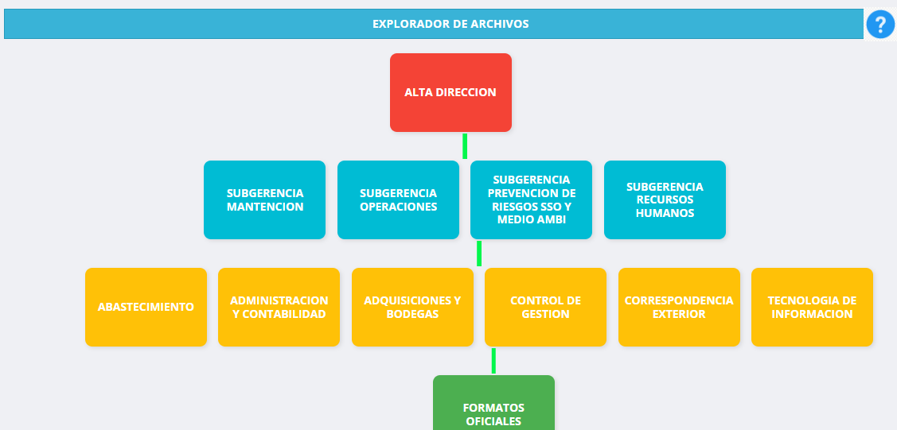
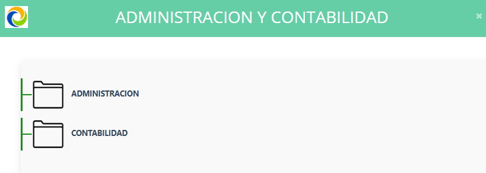
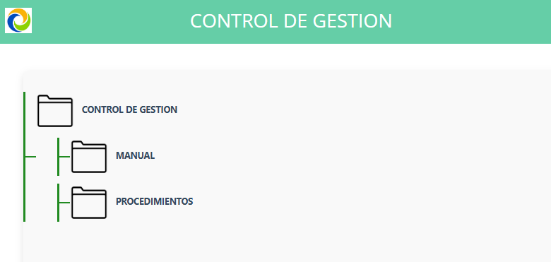

✨ Módulo de Interfaz y Documentación Visual (infografia-SGDOC)

Este repositorio contiene la implementación de diseño y la infografía conceptual creada para documentar y explicar la arquitectura o el flujo de trabajo del proyecto Sistema de Gestión Documental y de Contenidos (SGDOC). Se enfocó en transformar la interfaz existente para maximizar la experiencia de usuario (UX) y asegurar la claridad operativa.

1. Componente de Asistencia: El Ícono de "Ayuda"

Para mejorar la usabilidad y proporcionar soporte contextual, se implementó un ícono de "Ayuda" anclado permanentemente en la interfaz. Este ícono es fácilmente accesible en la parte superior derecha de la barra de título de cada página del sistema.
Al hacer clic en este ícono, se activa un modal que presenta una infografía detallada (diseño conceptual) para guiar al usuario a través del funcionamiento del sistema.
### Ícono de Ayuda Anclado

2. Transformación de la Interfaz del Explorador de Archivos

Este módulo revolucionó la gestión de archivos dentro del sistema al reemplazar el explorador de archivos estándar por una interfaz más intuitiva y funcional.

2.1. Nuevo Interfaz de Archivos (Vista en Cuadrícula)

El nuevo diseño presenta los archivos y carpetas en una vista de cuadrícula o botones (cuadrados). Esta interfaz limpia es el punto de entrada para acceder al nuevo explorador:
### Nuevo Diseño de Interfaz de Archivos

2.2. Activación del Modal del Explorador

Al seleccionar (apretar) cualquiera de los elementos (cuadrados/botones) de la interfaz de archivos, se abre un modal (ventana emergente) que contiene la funcionalidad completa del nuevo explorador de archivos.

### Modal con el Nuevo Explorador de Archivos

2.3. Navegación en Vista Cascada

La característica clave de este explorador es su sistema de navegación, que permite abrir las carpetas de manera secuencial en forma de cascada. Esta vista en cascada mejora drásticamente la capacidad del usuario para trazar la ruta del archivo y gestionar estructuras jerárquicas profundas.

### Vista de Carpetas en Cascada

🛠️ Requisitos Técnicos y Configuración Inicial

Para entender completamente o ejecutar los componentes funcionales de este módulo (cuyo código es predominantemente PHP), es necesario tener el entorno de desarrollo apropiado.

1. Entorno de Desarrollo Local
   
• Herramienta Requerida (Servidor Local): Se utilizó XAMPP para crear el entorno de servidor local. XAMPP (o herramientas similares como WAMP/LAMP) es esencial para ejecutar los archivos PHP (93.8% del código).

3. Conexión y Gestión de Datos

Aunque el repositorio fue catalogado como un componente finalizado de diseño, la funcionalidad subyacente de los exploradores de archivos requiere datos dinámicos.

• Manejo de Datos Dinámicos: Para que los datos (necesarios para el explorador de archivos y las carpetas) aparecieran en la interfaz, el sistema se configuró para conectarse a una base de datos SQL Server.

• Capa Intermediaria (json.php): La conexión entre el frontend y la base de datos se maneja a través del archivo json.php (ubicado en la carpeta json). Este archivo actúa como un endpoint que se conecta al SQL Server, recupera la información solicitada y la expone en formato JSON, permitiendo que el JavaScript (4.3% del código) la consuma y la muestre al usuario en el explorador.

⚠️ Estado del Proyecto y Tecnologías
Este repositorio representa un COMPONENTE FINALIZADO (DISEÑO/INFOGRAFÍA). Contiene la base de diseño, los activos gráficos (en la carpeta IMAGENES) y la funcionalidad prototipo de asistencia.
La integración final y el cumplimiento total de los requerimientos del cliente fueron completados en el repositorio principal, SGDOC.

💻 Stack de Tecnologías

| Tecnología | Porcentaje | Propósito Principal/Descripción |
| :--- | :---: | :--- |
| **PHP** | 93.8% | Principal lenguaje de programación utilizado para la lógica de servidor y la estructura del sistema [1]. Se requiere un entorno como **XAMPP** para la ejecución local [Conversación]. |
| **JavaScript** | 4.3% | Utilizado para la interactividad de la interfaz (como el modal de ayuda) y para la **comunicación asíncrona** con `json.php` para consumir datos de **SQL Server** y mostrarlos en el explorador [7, Conversación]. |
| **CSS** | 1.0% | Estilización de la interfaz de usuario, crucial para implementar la nueva **vista en cascada** y el diseño del modal de ayuda [7, Conversación]. |
| **Hack** | 0.9% | Parte del código base. |
| **HTML** | 0.0% | El marcado es generado y administrado principalmente a través de plantillas PHP 

📧 Conectemos

Mi enfoque profesional se centra en la funcionalidad y la experiencia de usuario, asegurando un código limpio y escalable.

• Perfil: Ingeniero en Informática | Desarrollador Full-Stack | Especializado en Shopify, Bots de Discord y Python/PHP.

• LinkedIn: Patricio Chávez.

• Email: pchavez.dev@gmail.com
